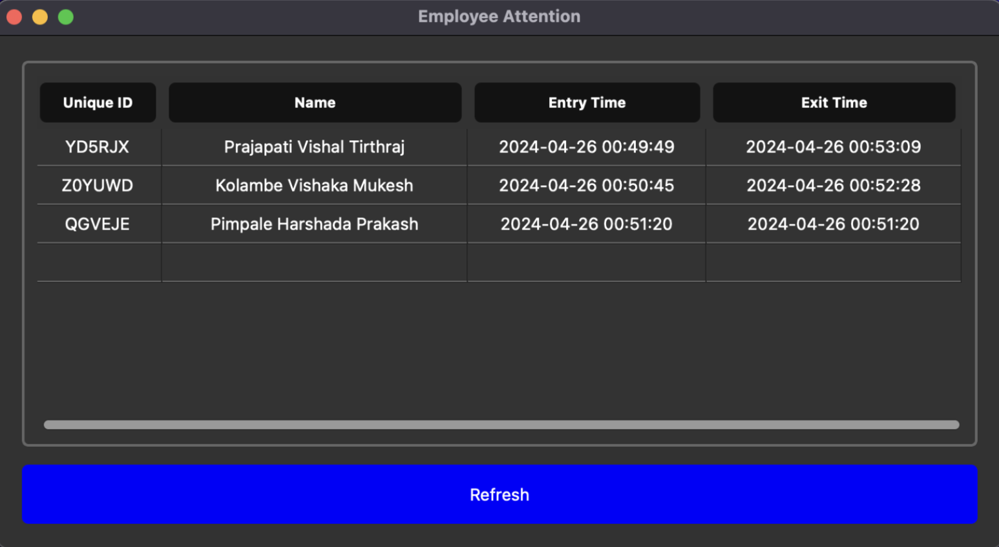
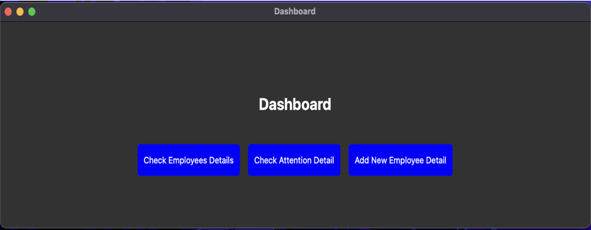

# Employee Attendance System using QR Code

## Overview
The **Employee Attendance System** is a Python-based project designed to streamline employee attendance tracking using QR code technology. It provides an efficient and secure way to manage attendance records while enhancing accessibility and usability.

## Features
- **QR Code-based Attendance**: Employees can mark attendance by scanning a QR code.
- **Admin Dashboard**: Manage employees, view attendance records, and access detailed reports.
- **User Authentication**: Secure login system for administrators.
- **Employee Management**: Add, update, and track employee details.
- **Real-time Entry & Exit Logs**: Records timestamps of employee check-ins and check-outs.
- **Interactive UI**: Built using PyQt5 for a modern and user-friendly experience.

## Technologies Used
- **Programming Language**: Python
- **Frameworks & Libraries**: PyQt5, OpenCV, SQLite3
- **IDE**: PyCharm

## Installation
### Prerequisites:
- Python 3.x installed
- Required libraries: Install dependencies using pip
  ```sh
  pip install pyqt5 opencv-python sqlite3
  ```

### Steps to Run:
1. Clone the repository:
   ```sh
   git clone https://github.com/your-username/employee-attendance-system.git
   ```
2. Navigate to the project directory:
   ```sh
   cd employee-attendance-system
   ```
3. Run the main application:
   ```sh
   python main.py
   ```

## Project Structure
```
├── main.py                 # Main application file
├── adminAccess.py          # Admin login panel
├── takingAttendance.py     # Attendance marking panel
├── qrCodeScanner.py        # QR Code detection module
├── dashboard.py            # Admin dashboard
├── addEmployee.py          # Employee management module
├── database.db             # SQLite database
├── README.md               # Project documentation
```

## Screenshots




## Conclusion
The **Employee Attendance System** improves efficiency in employee attendance tracking by integrating QR code scanning and real-time data management. This system ensures accuracy, enhances security, and simplifies record-keeping for organizations.
